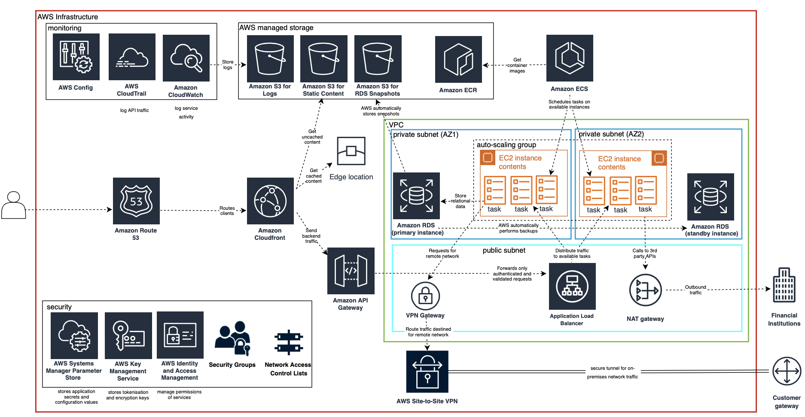
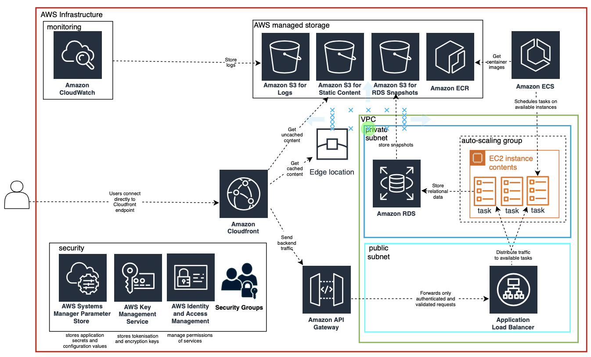

# Cloud Architecture for Financial Transactions Platform

This project is created for the selective module Cloud Advanced at IU International University of Applied Sciences.

(steps to repliacate architecture with tf script below)

### Task:

### Architecture Design

Production architecture designed ...

PoC Architecture ...

### Implementation

The PoC architecture was implemented through AWS, tested to ensure requests are routed to the proper components and return a response, then automated using Terraform.

### Replicate the infrastructure with Terraform

- add environment variables as seen in .env.example 

- log into aws via cli

- terraform apply